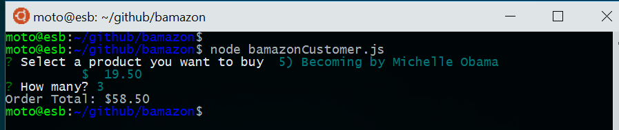

# Bamazon -- Amazon-like storefront

Amazon-like storefront Node.js app with a command-line interface using mySQL in the backend.

## Overview

There are two javascript files for two different command-line interfaces for 1)Customer,
and 2)Manager.

1. Customer CLI
    1. List available products and prompt a user to select a product 
    1. Ask the user how many units of the product s/he wants to buy
    1. Check if there are the sufficient units left in stock
        * If there are insufficient units in store, it will print `Insufficient quantity!` 
        * If there are sufficient units for the order left in store
            * Then, it will update the quantity of the product in the database 
            * It will print `Order Total` for the purchase
1. Manager CLI
    * The following four operation options are provided for the manager view
        * `View Products for Sale`
          * list every available item: the item IDs, names, prices, and quantities.
        * `View Low Inventory`
          * list all items with an inventory count lower than five.
        * `Add to Inventory`
          * display a prompt that will let the manager "add more" of any item currently in the store.
        * `Add New Product`
          - allow the manager to add a completely new product to the store.

## Files
```
├── README.md                 -- this file
├── bamazonCustomer.js        -- Javascript file for customer CLI
├── bamazonManager.js         -- Javascript file for manager CLI 
├── bamazonStore.js           -- Base javascript file for bamazonCustomer.js and bamazonManager.js
├── homework_instructions.md  -- the original homework instructions
├── mysql_config.js           -- configuration file for MySQL connection
├── package.json              -- NPM package file
└── sql
    ├── bamazon.sql           -- For creating the database and table
    └── mock_data.sql         -- mock product data 
```

## Descriptions 

### Setup

* MySQL Database
    * MySQL server needs to be up and running with all CRUD privileges.
    * MySQL connection parameters have to be set properly in the file `mysql_config.js`
      ```
      const connParams = {
        host: 'localhost',
        user: 'root',
        password: 'password',
        database: 'bamazon'
      };
      ```
    * The query file `sql/bamazon.sql` can be used to set up the necessary database and tables.
    * The query file `sql/mock_data.sql` can be used to populate the table with sample data.
* NPM modules
    * All necessary packages can be fetched and installed based on the `package.json`
      ```
      $ npm install
      ```
    * This app makes use of the following modules/packages
      ```
        "console.tablefy": "^1.0.2",
        "inquirer": "^6.2.1",
        "mysql": "^2.16.0",
        "printf": "^0.5.1"
      ```

### Bamazon Customer

* The app will take in orders from customers and deplete stock from the store's inventory. In the application top directory, call node.js with the javascript "bamazonCustomer.js" as a command-line argument.
    ```
    $ node bamazonCustomer.js
    ```
* The following image shows the initial prompt with a list of available products from the sample mock data.
    
* Users can use up and down arrow keys to move over the products. Once decide on a product to buy, hit enter key. In the following image, the product #5 (a book) was selected and the order total is shown for the 3 books.
    

### Bamazon Manager

* This app includes four different options for different operations for a store manager. The options will be displayed at the initial screen upon running the `bamazonManager.js` file.
    ```
    $ node bamazonManager.js
    ```

* The following image shows the initial prompt with 4 options for the manager view
    

1. `View Products for Sale`
    * This option will list all products for sale 
    
1. `View Low Inventory`
    * This options will list all items with an inventory count lower than five.
    
1. `Add to Inventory`
    * This options displays a prompt that will let the manager "add more" of any item currently in the store.
    
1. `Add New Product`
    * allow the manager to add a completely new product to the store.
    
    